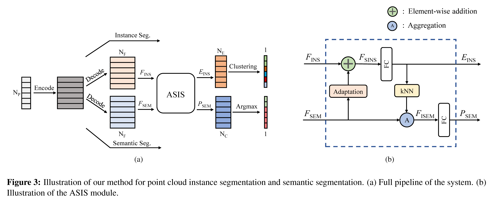

# Associatively Segmenting Instances and Semantics in Point Clouds

[[arXiv]](https://arxiv.org/abs/1902.09852)

## Overview


## Dependencies

The code has been tested with Python 2.7 on Ubuntu 14.04.
*  [TensorFlow](https://www.tensorflow.org/)
*  h5py


## Data and Model

* Download 3D indoor parsing dataset (S3DIS Dataset). Version 1.2 of the dataset is used in this work.

``` bash
python collect_indoor3d_data.py
python gen_h5.py
cd data && python generate_input_list.py
cd ..
```

* (optional) Prepared HDF5 data for training is available [here]().

* (optional) Trained model can be downloaded from [here](https://drive.google.com/open?id=1UF2nfXdWTOa1iXXmD54_c09rM7pr-kMK).

## Usage

* Compile TF Operators

  Refer to [PointNet++](https://github.com/charlesq34/pointnet2)

* Training
``` bash
cd models/ASIS/
ln -s ../../data .
sh +x train.sh 5
```

* Evaluation
``` bash
python eval_iou_accuracy.py
```

Note: We test on Area5 and train on the rest folds in default. 6 fold CV can be conducted in a similar way.

## Citation
If our work is useful for your research, please consider citing:

	@inproceedings{wang2019asis,
		title={Associatively Segmenting Instances and Semantics in Point Clouds},
		author={Wang, Xinlong and Liu, Shu and Shen, Xiaoyong and Shen, Chunhua, and Jia, Jiaya},
		booktitle={CVPR},
		year={2019}
	}


## Acknowledgemets
This code largely benefits from following repositories:
[PointNet++](https://github.com/charlesq34/pointnet2),
[SGPN](https://github.com/laughtervv/SGPN),
[DGCNN](https://github.com/WangYueFt/dgcnn) and
[DiscLoss-tf](https://github.com/hq-jiang/instance-segmentation-with-discriminative-loss-tensorflow)
